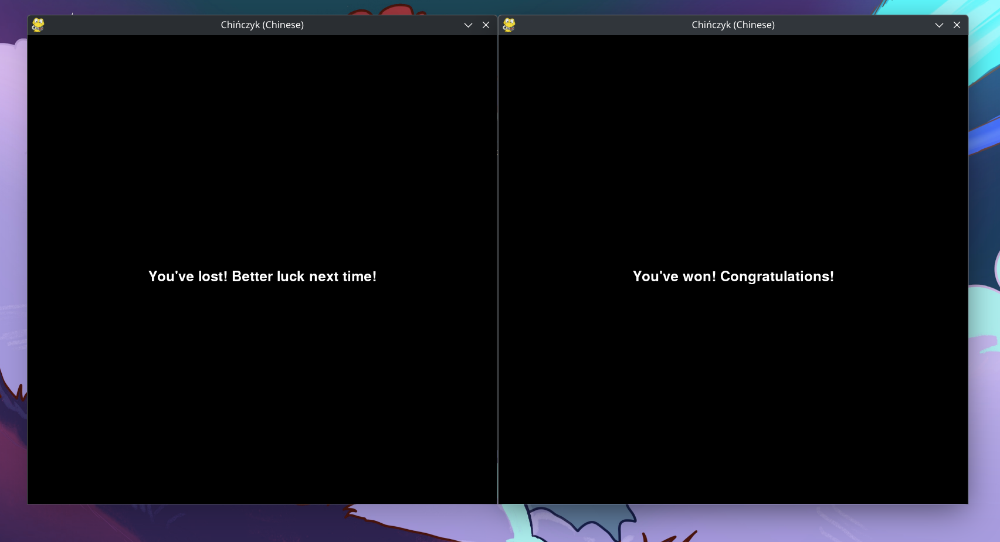

# man-dont-get-angry

game of chińczyk (Man, Don't Get Angry)

## Installation of necessary dependencies
```sh
pip install requirements-client.txt -r
# pip install requirements-server.txt

```

## Running a server
```sh
python3 server.py
# podman run -it -p 2137:2137 ghcr.io/nougcat/chinczyk:latest
# docker run -it -p 2137:2137 ghcr.io/nougcat/chinczyk:latest
```

## initializing gmae
```sh
# by default port is 2137
curl "localhost:PORT/game_init?how_many_players=2" # you can choose a number {2,3,4}  instead of 2
```

## Running game
```sh
python3 client.py
```
## How to play?

rules are [here](https://en.wikipedia.org/wiki/Mensch_%C3%A4rgere_Dich_nicht#Overview)

if you want to choose pawn just select a number from 1-4; basically your pawns are numbered as proximity to the end line. So if a pawn is not on the board you can move it by pressing `4`; but if you want to move pawn that is the closest to finish line just press `1`

all the other specs that i made while creating this project are avalible [here](project_specs.md)

## Multimedia





## Retrospection on this project:
my thoughts on this project:
- I have learned fastapi, even though it's propably styled not in a good way i learned a lot and next time i will write it better
- I despise pygame
- I made a recap of bash function, but also what's not visible - i used [unix pipes](https://en.wikipedia.org/wiki/Pipeline_(Unix)) to get rid of useless garbadge that fastapi is showing me, and i focused on warnings, errors and info logs

overall this project was PITA, but i learned a lot
