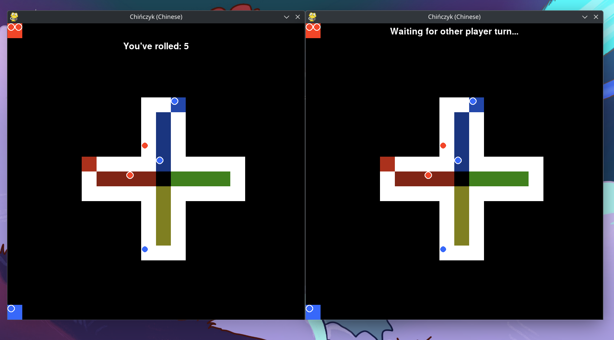

# man don't get angry

The game of chińczyk (Man, Don't Get Angry)

## Installation of necessary dependencies
```sh
pip install requirements-client.txt -r
# pip install requirements-server.txt -r

```

## Running a server
```sh
python3 server.py
# podman run -it -p 2137:2137 ghcr.io/nougcat/chinczyk:latest
# docker run -it -p 2137:2137 ghcr.io/nougcat/chinczyk:latest
```

## initializing game
```sh
# by default port is 2137
curl "localhost:PORT/game_init?how_many_players=2" # you can choose a number {2,3,4}  instead of 2
```

## Running game
```sh
python3 client.py
```
## How to play?

rules are [here](https://en.wikipedia.org/wiki/Mensch_%C3%A4rgere_Dich_nicht#Overview)

- If you want to choose a pawn, just select a number from 1-4
- Your pawns are numbered based on proximity to the finish line. 
- Additional info: If your pawn is not on the board, you can get it on board by pressing any key (1-4) as all the pawns are in the same proximity to the finish line
- But if you have any pawns on the board, it's crucial to keep in mind and not mindlessly press keys, as you can lose your turn.

Before making the project, I made initial specs, and while doing the project, I made small revisions. You can find the final specs [here](project_specs.md)
## Multimedia




## Retrospection on this project:
- I have learned fastapi, even though it's probably written in the most pythonic way, nor in a way that's the most modern and advised by documentation (because of my lack of skills). Next time, I will make it much clearer.
- I despise pygame
- I had to recap on how to do shell scripts, how [UNIX pipes](https://en.wikipedia.org/wiki/Pipeline_(Unix)) work (so I can focus on just the important logs from fastapi)
- I made [and published my first container image](https://github.com/users/nougcat/packages?repo_name=man-dont-get-angry)
- made a debian package, but I have decided to not publish it

overall this project was a PITA, but I have learned a lot
